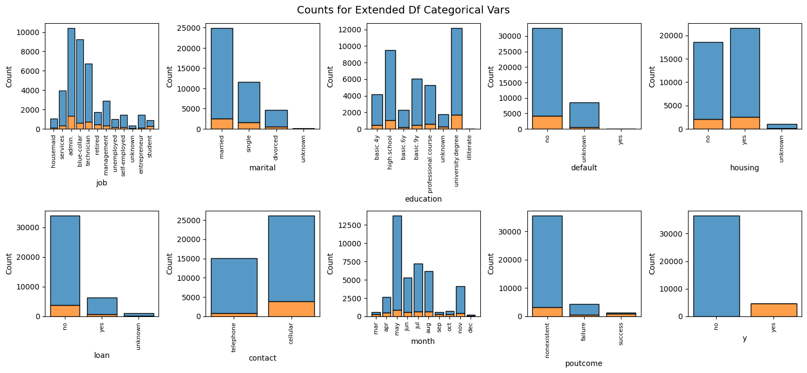

# DATA622 - Assignment 1
_Marco Castro_

## Exploratory Data Analysis

For Assignment 1, we were asked to perform Exploratory Data Analysis of a bank marketing dataset from Portuguese bank conducting a marketing campaign with the goal of using machine learning to help predict if a client will subscribe to bank term deposit from a collection of variables that include information about the client's age, job, marital status, education, loan and default status, and previous and past campaign details (number of calls and outcome).

Of the four CSV's that were included in the dataset, I compared the files "banks_full.csv" and "banks_additional_full.csv". I discarded the other two CSV's comprised of 10% randomly sampled observations from their corresponding "full" counterparts, as the randomly sampling method does not specify if steps were taken to ensure that it is a balanced representative subset. Furthermore, the additional data points of the full dataset may be useful for working with more complex models and avoiding falling victim to the _Curse of Dimensionality_. We would be able to generate our own subset sampled from the full dataset if necessary "for working with more computationally demanding machine learning algorithms" as the datasets' author suggests.

For the purposes of this report, I will be referring to "banks_full.csv" as the _original_df_ and "banks_additional_full" as _extended_df_. _original_df_ is comprised of 45211 observations with 16 features + label column "y" for a total of 17 variables, while _extended_df_ is comprised of 41188 observations with 20 features + label column "y", for a total of 21 variables. 

### Differences Between the Two Datasets

A cursory view of the column types and data shows the following differences:

* balance (integer) - the client's bank balance. This field is present in _original_df_ and missing from _extended_df_;
* emp.var.rate (float) - This field is present in _extended_df_ and missing from _original_df_
* cons.price.idx (float) - This field is present in _extended_df_ and missing from _original_df_. 
* cons.conf.idx (float) - This field is present in _extended_df_ and missing from _original_df_
* euribor3m (float) - This field is present in _extended_df_ and missing from _original_df_
* nr.employed (float) - This field is present in _extended_df_ and missing from _original_df_

The latter five fields appear to be engineered features but no additional information is available about what they represent or how they were computed. We will drop these fields as we don't know the methodology that was used to generate or obtain these values. 

#### Categorical Variable Comparison

Distributions in our categorical variables appear somewhat similar but with the following differences:

* education (categorical) - contains different values between the two dataframes; values for _extended_df_ have more specific information ("basic.4y", "basic.6y", "basic.9y", "high.school", "illiterate", "processional.course", "university.degree", "unknown") while _original_df_ has more general values ("primary", "secondary", "tertiary", "unknown").
* day vs day_of_week - an additional difference is how contact day was captured. _original_df_ uses an integer value for the day of month (1-31), while _extended_df_ uses a categorical for the day of the week (Mon-Fri)
* pdays - the coding for "never contacted" is different between _original_df_ (999) and _extended_df_ (-1). These were transformed to -1 for both comparison between datasets and ease interpretation of visualizations.
* contact - _original_df_ contains values classified as `unknown` while _extended_df_ contains none.
* poutcome - _original_df_ contains values classified as `unknown` while _extended_df_ contains none.
* marital - _extended_df_ contains values classified as `unknown` while _original_df_ contains none.
* default - _extended_df_ contains values classified as `unknown` while _original_df_ contains none.
* housing - _extended_df_ contains values classified as `unknown` while _original_df_ contains none.
* loan - _extended_df_ contains values classified as `unknown` while _original_df_ contains none.

#### Non-categorical Variable Comparison

The central tendency, Inter-Quartile Range (IQR) and spread of our non-categorical variables are similar between _original_df_ and _extended_df_. In particular:

* age - the 25th percentile/median/75th percentile are nearly identical with quartile values of 33/39/48 and 32/38/47 and standard deviations of 10.62 and 10.42 for the _original_df_ and _extended_df_ respectively. The maximum age is lower than for _original_df_ (95) vs. _extended_df_ (98).
* duration - the 25th percentile/median/75th percentile are nearly identical with quartile values of 103/180/319 and 102/180/319 and standard deviations of 257.52 and 259.28 for the _original_df_ and _extended_df_ respectively. The maximum value for both is 4918 seconds (1 hour and 22 minutes).
* campaign - the quartile values are the same for both datasets (1/2/3) but the maximums differ (63 vs 56)
* pdays - the quartile values are the same for both datasets (-1/-1/-1)  but the maximums differ (871 vs. 27). Note that a value of -1 represents a client that has never been contacted. Therefore, we may need further explore this variable by possibly separate this data, as our data is centered around clients that have never been contacted before.
* previous - the quartile values are the same for both datasets (0/0/0) but the maximums differ (275 vs 7). Note that the huge difference in ranges could be attributed to binning if these _extended_df_ is derived from _original_df_
* balance - In _orginal_df_, the mean balance is 1362.27, with minimum value of -8019 and a maximum value of 102127. This gives us a right-skewed distribution with a heavy large tail representing clients with large balances and suggests that using this variable in our model will produce poor model fit as it may be overly sensitive to our outliers with high leverage and influence. Note this field is not present in _extended_df_.
test_scores
#### Additional Differences

A few interesting differences between _original_df_ and _extended_df_ stand out. In particular, `pdays` —- the number of days that passed after the client was last contacted from the previous campaign -- has a narrow spread (-1 to 27 days) in _extended_df_ and a wider spread in _original_df_ ranging (-1 to 871 days or over 2.38 years), where -1 is a code for never contacted. Similarly `previous` _contacts before this campaign for this client_ has a shorter spread (0-7) in _extended_df_ and a initial _original_df_ spread of 0-275 adjusted to 0-58 if we remove a single extreme outlier at 275. These differences may be represent differences in the client selection criteria for the former and differences in the lengths of the campaigns themselves for the latter. 
 
The author makes reference to the _original_df_ as an older dataframe. While at first glance, it  was not clear if _extended_df_ was generated from _original_df_ after data-engineering, there are sufficient differences in the data to suggest that they contain data points from different campaigns. For example, many of the categorical variables include `unknown` answers in _extended_df_ where there were no unknown answers in their corresponding _original_df_ fields. Furthermore, the spread of the number of last contacted days is significantly shorter, suggesting that campaigns were potentially tracked more frequently. 

It is worth noting that an alternative explanation for these differences might be due to modifications made to the data, such as corrections to the _original_df_ data, binning, dropped observations and other feature engineering techniques used to produce _extended_df_. Evidence to suggest this include the similarities in the central tendencies and spread of the numerical features. For example, the IQRs for `duration` and `age` are almost identical,  with a maximum value for `duration` of exactly 4918 for both datasets. However, the maximum `age` in _extended_df_ is higher (98 vs 95). This suggests that if _extended_df_ is based off of _original_df_, data points may have been modified, corrected and/or transformed. This would help explain the higher maximum age in _extended_df_ .  

In any case, our predictions may benefit from the more current data offered in _extended_df_ given that it may contain corrections over _original_df_ or capture possible changing trends in customer behaviours if altogether a more recent dataset. While we do loose the `balance` variable in _extended_df_, we would likely not include this metric as an independent variable in our model, as data is right skewed with a heavy right tail for large balances that may bias our models. As such, the following exploration will focus on _extended_df_.

### Examining Categorical Variables

A review of categorical counts, shows that 88.3% of clients responded "no" the bank's term deposit for this campaign (our dependent variable), while 11.7% responded "yes". This means that our data is imbalanced which may introduce bias into our models, as the model may overly predict majority "no" classes. The majority of clients tend to work in admin (25.3%), blue-collar (22.5%), and technician (16.4%), and have a high school education or university degree. The majority do not currently have a personal loan (82.4%) or have not defaulted on a loan (69.12%). Slightly more clients contacted have a house loan (52.3% vs 45.2%). It should be noted that 20.9% of values for default status and 2.4% of personal and housing loans are marked as "unknown". More clients were reached by cellular phone (26,144) than by telephone (15,044) and more clients were last contacted over the summer months may to august than the rest of the year, with the most contacts made in May.

The proportion of clients that subscribed to a term deposit (y = yes) generally falls between 5-15% of the total number of clients within a given category. For example, 10.2% of clients identified as married responded "yes" to the campaign, 10.3% identified as divorced, and 14% identified as single. For housing and personal loan, this range was even closer as between 10.8-11.6% and 10.8-11.3% responded "yes" for "unknown", "yes", or "no", although `defaults` responded "yes" 5.2%, 0%, and 12.9% respectively. Most `jobs` and `education` categories responded "yes" within the range of 5-15% , with some notable exceptions: 

* 31.4% of 875 students (2.1% of total sample population)
* 25.2% of 1720 retired individuals 
* 22.2% of illiterate individuals, though the number of total clients for this group is only 18 clients or 0.04% of the total sample population.
Additionally 65.1% of successful past outcome (`poutcome`) clients responded yes to the campaign. Given the small sample size of illiterate, should consider combining with another category if one-hot encoding.

There is also a fairly equal distribution of campaign calls across all `day_of_week` for our _extended_df_. We may consider dropping this parameters to save additional degree of freedom, as they may not add much to our model's predictions. 

### Examining Non-Categorical Variables

Visualizing pairplots for our non-categorical variables reveals some patterns in our data. First, our date is right-skewed and is not normally distributed; performing a log transformative on the data may with normality. Further, many of our plots show a reverse funnel shape suggesting that our data is very linear. This is due to the large number of clients (39,673) flagged as "not previously contacted" (`pdays` with a value of -1). All pairplots plotted against `pdays` show a clear band of observations at y = -1. We may need to create a feature flag for "not previously contacted" to avoid introducing heteroscedasticity into our models. Interestingly, 9.3% of observations flagged as "not previously contacted" responded yes to the bank's term deposit. This may be due to data entry errors or may be a result of users signing up for the service on their own, such as through a bank branch. We would need to verify if these observations are true "yes" responses to better understand their relevance.

The funnel shape is particularly obvious in the `duration` vs `campaign` and `previous` vs `campaign` where data has a wider spread along the x-axis as y approaches zero which narrows to a point as x approaches 0 when y increases. Visualizing the yes vs no responses shows a band of "no" responses at or near x = 0 for both variables. This conceptually makes sense, as calls with a duration of 0 seconds (didn't pick up) can't have a positive outcome; furthermore, short calls (some seconds) are not likely to produce a positive outcome. The dataset's author recommends omitting this variable from our model. Similarly, clients that were never contacted previously and not yet contacted cannot respond 'yes' to the bank term deposit.

The funnel is less defined for `age` vs `campaign` as observations are more spread out. However, the plot shows a greater number of contacts performed during this campaign for working-age adults (24-59). This might be because calls made during traditional office hours may be less likely to be answered by people whose work schedules match those hours. Most of the "yes" observations for our dependent variable are clustered when y is less than 10 suggesting that continuous calls may be ineffective for clients that are less likely to answer. 

#### Outliers

Examining boxplots for our non-categorical variables suggests the presence of outliers for all variables, whereby many observations fall beyond the upper whiskers. These outliers are confirmed in out pairplots. For example, `duration` appears to have a somewhat large outlier of 4918 seconds of last contact (1 hour, 22 mins) while the "upper whiskers" from our IQR is 643. Performing a log transformative on the data may help minimize the effects of these outliers.

The median and IQR for `age` are similar between the yes/no values of our dependent variable in both datasets suggesting that `age` may be a weak predictor as there is little variability from one or the other. Similarly, the IQFs for `campaign` - number of contacts performed during this campaign and for this client - are also very similar; while there is some variation in _extended_df_, there the IQRs and upper whiskers for _original_df_ are very similar between our dependent variable. The  similarities in spread and distribution are closely matched `pdays` -- number of days that passed by after the client was last contacted from a previous campaign  -- in _extended_df_, where as the the upper IQR is very pronounced in _original_df_.

#### Correlation

Performing a Pairwise Correlation test shows that while most variables have weak correlation to each other, some variables have strong correlation values suggesting the presence of multicolinearity. Including highly correlated variables could create unstable coefficients, inflate standard errors, and could overly complicate our models. 

The table below shows the 20 pairings with the highest correlation values. Here we see that `housing_unknown` vs `loan_unknown` have perfect correlation. A few other noteworthy pairings include `previous` and `poutcome_nonexistent`, `pdays` vs `poutcome_success`, `marital_single` vs `marital_married`, which have a correlation value of over +/-0.6, our rule of thumb threshold for identifying high correlation values and should consider dropping one of these variables from our model to avoid introducing multicollienarity. We would need to gather subject expertise further to get a better understanding of the true threshold.  Variance Inflation Factor (VIF) test results suggest we should consider `age` (VIF: 17.4) along with `housing_unknown/loan_unknown`, `poutcome_nonexistent`, and `marital_married` as we previously found. 

| col                  | variable             | corr      |
| -------------------- | -------------------- | --------- |
| housing_unknown      | loan_unknown         | 1.000000  |
| previous             | poutcome_nonexistent | -0.878776 |
| poutcome_success     | pdays                | 0.778275  |
| marital_single       | marital_married      | -0.773785 |
| poutcome_success     | previous             | 0.524045  |
| previous             | pdays                | 0.506531  |
| education_tertiary   | education_secondary  | -0.504555 |
| poutcome_nonexistent | poutcome_success     | -0.466928 |
| job_retired          | age                  | 0.440772  |
| pdays                | poutcome_nonexistent | -0.429549 |
| age                  | marital_single       | -0.411703 |
| duration             | y_yes                | 0.405274  |
| job_blue-collar      | education_primary    | 0.366260  |
| education_tertiary   | job_blue-collar      | -0.336592 |
| education_secondary  | education_primary    | -0.336312 |
| poutcome_success     | y_yes                | 0.316269  |
| education_tertiary   | education_primary    | -0.279483 |
| pdays                | y_yes                | 0.279025  |
| age                  | marital_married      | 0.271266  |
| job_services         | education_secondary  | 0.266532  |

---

## Algorithm Selection

The Bank data for this analysis is labeled with the dependent variable `y` is a binary categorical variable with values "yes" and "no". The presence of labels means that we can use supervised machine learning algorithms that have been introduced so far in the semester, including Logistic Regress, Decision Trees, k-NN, LDA/QDA, and Naive Bayes. If the data was not labeled, we would select from unsupervised machine learning algorithms such as k-Means clustering and PCA.

Of the machine learning algorithms that we have been introduced to, Decision Trees, K-Nearest Neighbors (k-NN), and Quadratic Discriminat Analysis (QDA) appear to be the best fit for our dataset. While initially I considered logistic regression given and LDA, data exploration revealed that our data is not linear, making neither algorithm suitable for our data as we would violate the linearity assumptions inherent in theses algorithms. By contrast, Decision Trees, k-NN, and QDA does not make these assumptions.

### Algorithms Comparison

#### Decision Tree

A Decision Tree is non-parametric algorithm that splits at nodes based on feature values that create a tree-like structure. As a non-parametric method, Decision Trees don't make assumptions about the distribution of our data. Therefore, it is suitable for data that does not follow any specific pattern such as normal distribution. Decision Trees work well with mixed data (categorical and numerical) while being relatively computationally efficient on large datasets such as ours. Another advantage is in the ease of interpretation which can be good for communicating with stakeholders and decision makers when designing a future campaign. Additionally, data does not necessarily need to be normalized and imbalanced data is less of a concern, though implementing Class Weighting can help the model performance. A major disadvantage is that Decision Trees can be prone to over-fitting. Decision Trees can also become unstable if there are too few records. Therefore, we should implement pruning in order to prevent over-fitting or attempt an ensemble method such as Random Forest when working with this algorithm.  

#### k-Nearest Neighbors

k-Nearest Neighbors (k-NN) is non-parametric algorithm that can model complex boundaries well. Since the algorithm needs to compute each distance between data points, k-NN is computationally expensive. The algorithm may take some time to calculate all 40k+ observations in our dataset. Like a Decision Tree, k-NNs are easy to interpret. However, they can be more sensitive to irrelevant features as well as data using different scales. They are negatively impacted by imbalanced data. Therefore, we would need to standardize our data, implement dimensionality reduction and address imbalanced data before modeling when working with this algorithm.

#### QDA

Quadratic Discriminant Analysis (QDA) is a parametric algorithm that assumes that observations within each class are drawn from a multivariate Gaussian distribution. QDA assumes that each class has its own covariance vectors. A major advantage of using QDA is that it outputs probabilities not just labels. While QDA is effective on Gaussian distributions, it may perform poorly with our dataset where many of the features do not have normal distributions. One-hot encoding of our categorical variables can inflate the overall dimensions in our model. This can make covariance matrices large and require a large enough dataset to avoid become noisy and computationally unstable or even impossible to compute. They can also be sensitive to outliers and different scales and are negatively impacted by imbalanced data. Therefore, we will need to address outliers, standardize our data, address imbalanced data before modeling when working with this algorithm.

#### Recommended Algorithm 

While it would be preferable to test the performance of all three algorithm before selecting one, I am selecting the Decision Tree algorithm to start my analysis given the size of our dataset (41k), the fact that it mixes categorical and numerical variables, and that our numeric parameters are non-linear or normally distributed. Decision Trees should be able to handle the number of records relatively efficiently, work well with mixed data even without one-hot encoding, and don't require linear data. In contrast, both KNN and QDA may perform poorly, given the number of categorical variables that need to be one-hot encoded that would inflate the number of dimensions in our dataframe.  KNN will also be computationally expensive for a dataframe of our size. QDA also assumes that our data is normally distributed, while our data does not appear to be. However, pruning correctly will be critical to avoid over-fitting our data. Alternatively, we could use an Ensemble Tree improve our model's performance.

Decision Trees would still be an effective choice for our dataset even had less than 1,000 observations due to the number of features in our dataset. While k-NN would be able to process the smaller dataset better than the larger one, it may still struggle to perform well since it requires one-hot encoding our categorical varibles. This increases the number of dimensions that the algorithm needs to work with, which results in added noise and may make if difficult to compute the distances between points at high dimensions. We would need to implement dimensionality reduction to improve outputs. QDA would continue to suffer from the aforementioned issues, given that representational sample of our data would violate its normality assumption.

---

## Pre-processing

Below is summary of pre-processing steps that would be taken before modeling our data.

_Data Cleaning_ 

As our data does not include any missing values, we do not need to implement imputation techniques. Given the number of observations (41k+), we could consider dropping some extreme outliers. 

_Dimensionality Reduction_  

To improve our model and reduce its overall dimensions, we should remove redundant data. First we should drop emp.var.rate, cons.price.idx, cons.conf.idx, euribor3m, nr.employed from _extended_df_, as no information is available describing what they represent or the methodology used to derive them. 

Next, we would drop variables with high correlation. Results from a Pairwise Correlation and VIF test, suggest that we should drop the `marital_married_ and `previous` variables. VIF also suggest that we consider dropping `age`. When one-hot encoding our categorical variables, we saw perfect correlation `housing_unknown` vs `loan_unknown`; the `housing_unknown` field should also be dropped if using KNN or QDA and one-hot encoding. Additionally, `poutcome_nonexistent` shows high correlation against both `previous` and `pdays` and should be dropped. 

`duration` should also be dropped, as calls with a duration of or close to 0 seconds will generally have a "no" response, although there is small number of observations with a "yes" response; conversely longer calls tend to result in `yes` response.  Similarly `month` as only "yes" responses would indicate a relationship between month of year and a positive result (last contact month also captures calls that were not answered). Finally, we should drop `day_of_week` as all days have very similar distributions for both "yes" and "no" responses, suggesting a weak or no relationship between day of the week and a positive respones.

_Feature Engineering_

Given the high number of clients that were not previously contacted (value -1), we should create a new dummy categorical variable to specifically capture where 1 represents if the client was contacted and 0 represents when clients were not previously contacted. This may improve model performance and prevent interpreting the value -1 or 999 as a numeric value that may influence our model. Furthermore, if using Decision Trees, this will create a good split for clients that were never contacted.

_Data Transformation_ 

Because our independent variables have varying scales, we should normalize our data if using KNN or QDA. Decision Trees can work with the raw data to create the splits and normalizing might make it harder to interpret the data. Similarly, we would one-hot encode our categorical variables for KNN and QDA to simplify our data, but would not one-hot encode if using Decision Trees for interoperability and to avoid adding dimensions in our model. If one-hot encoding, we should consider binning some of our categorical variables such as education to further simplify our model.
 

_Addressing Imbalanced Data_

Roughly 88% of clients responded "no" to the current bank's term deposit campaign (our dependent variable), while only 11.7% responded "yes" and thus our data is imbalanced. To prevent introducing bias in our data, where our majority class ("no") could always be predicted, we need to implement class balancing techniques. While we do not necessarily need to balance our data if using Decision Trees, we could use Class Weighting  as it preserves the original dataset and has lower risk of over-fitting. By comparison SMOTE creates synthetic samples, which may not be representative of a real world scenarios, but work well with KNN models. For QDA, we can use class priors and combine it with SMOTE.  

_Sampling Data_ 

Sampling might be necessary to create a training and testing set that can be used to test the performance of our model. Having separate training and testing sets ensures that the model does not "see" our test data and helps prevent over-inflated prediction accuracy and over-fitting. Training sets are typically ~80% of the observations of total dataframe and testing sets ~20%. We should attempt to produce sampled sets that are representative of full dataset.

As discussed in the previous section, we may also need to sample our data if implementing SMOTE to balance our data for KNN and QDA.

## Conclusion

Decision Trees appear to be a good place to start modeling our data due to its size (41k observations) and its use of mixed categorical and numeric variables. As a non-parametric algorithm, Decision Trees make few assumptions and do not require that the data is follows a specific distribution. However, pruning correctly will be critical to avoid over-fitting our data. In future work, we may be improve our model's performance through ensemble methods. 